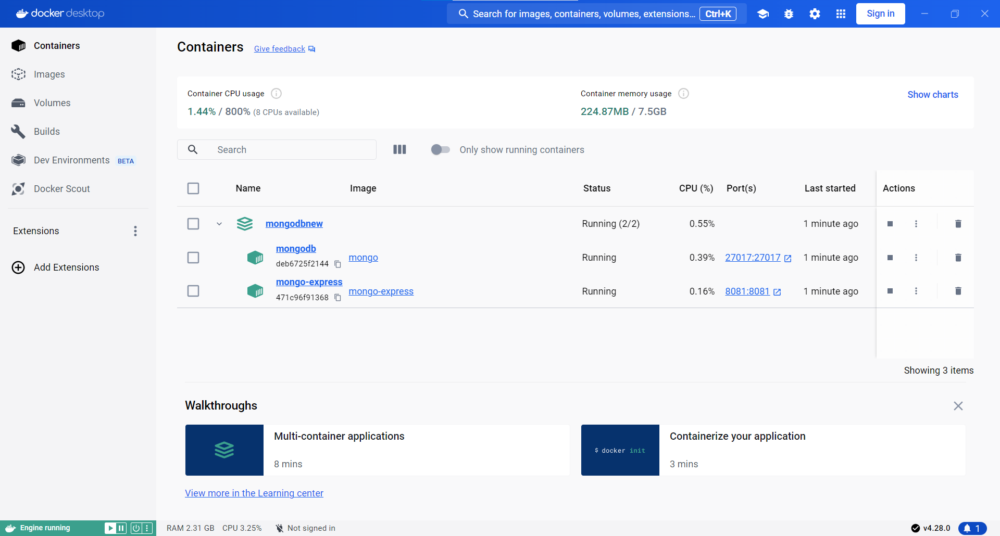
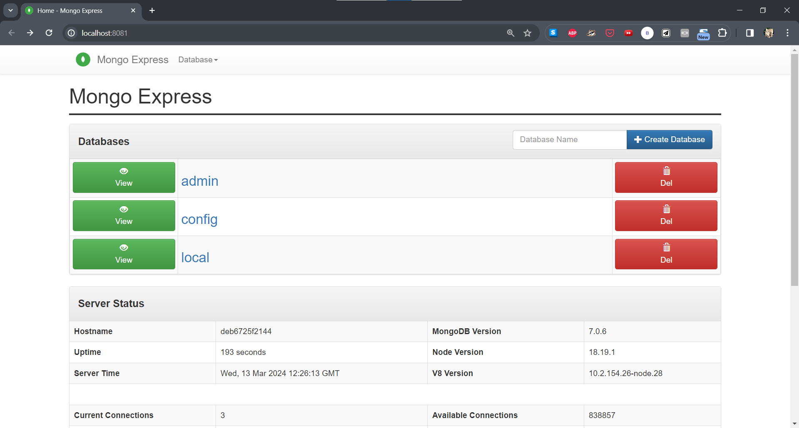
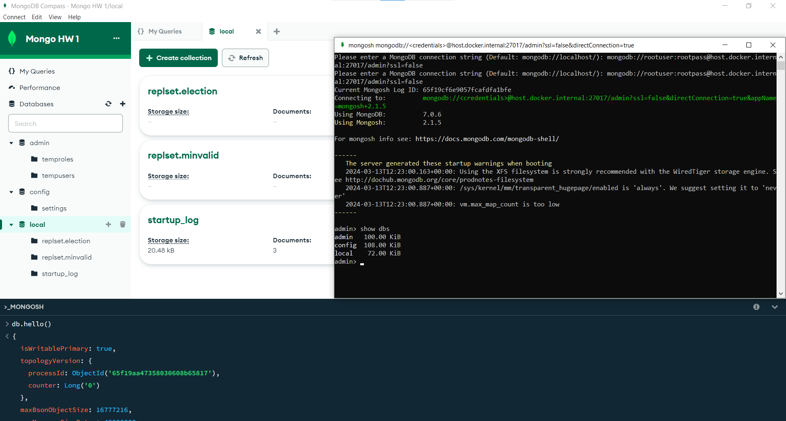
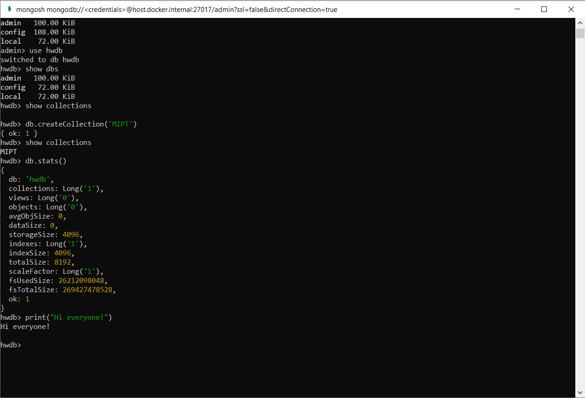

# 2024-Database-systems 1 задание
Homework and materials for the Database Systems course

## Отчет

### Установка Mongo и запуск в Docker

Docker у меня уже был установлен ранее, я создал кофиг для Docker Compose `MongoDocker.yml`, и запустил этот файл командой:

```
docker-compose -f .\MongoDocker.yml up -d
```

<p align="center">
  
  <br>
  <em>Докер с запущенными контейнерами с mongoDB</em>
</p>


Взаимодействовать можно с помощью mongo-express (см. [рис 2](#image2))
, MongoDB Compass и mongosh (см. [рис 3](#image3)).


<a id="image2"></a>
<p align="center">
  
  <br>
  <em>Докер с запущенными контейнерами с mongoDB</em>
</p>

  <a id="image3"></a>
<p align="center">
  
  <br>
  <em>MongoDB Compass и mongosh</em>
</p>


### Начао работы с mongo через mongosh

Создать базу данных и переключится на нее можно с помощью команды`use`. Посмотреть на не пустые базы данных можно с помощью `show dbs`. Создать колекцию с помощью `db.createCollection`, а посмотреть колекции `show collections`. Статистика по ДБ выводится `db.stats()` MongoDB написана на C++ и в ней можно исполнять код, наример `print("Hi everyone!")` (см. [рис 4](#image4))

<a id="image4"></a>
<p align="center">
  
  <br>
  <em>Начало работы</em>
</p>
