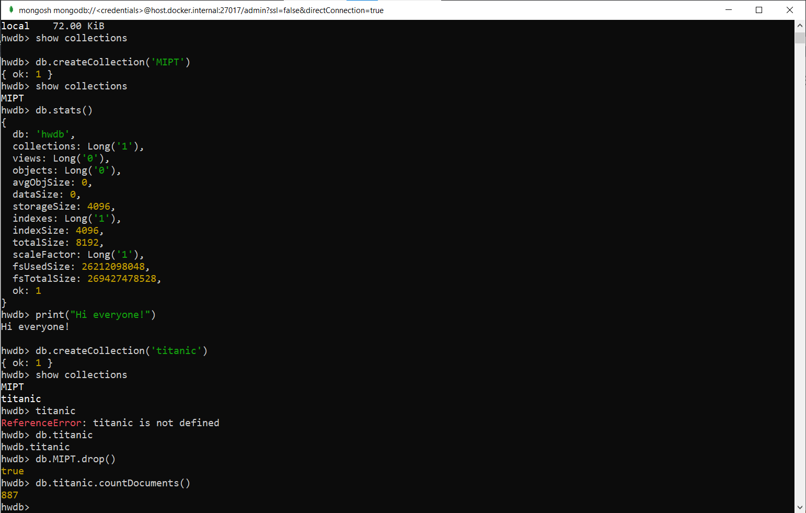
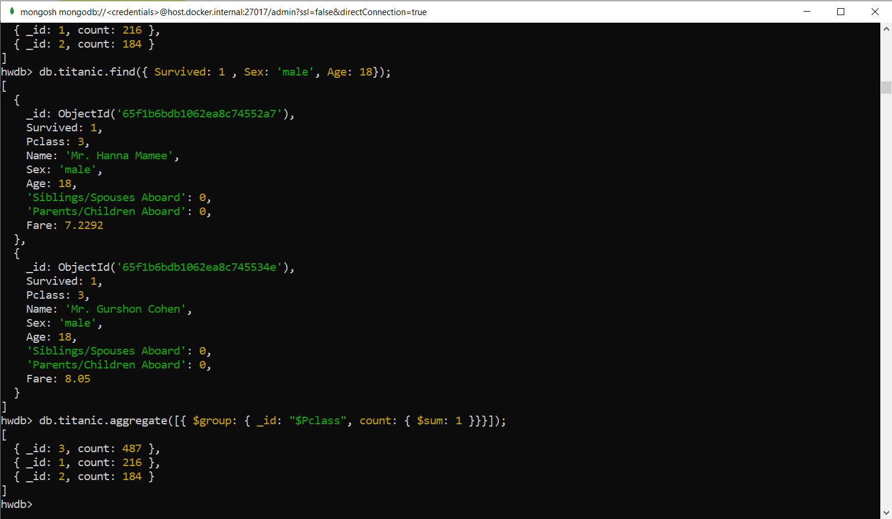
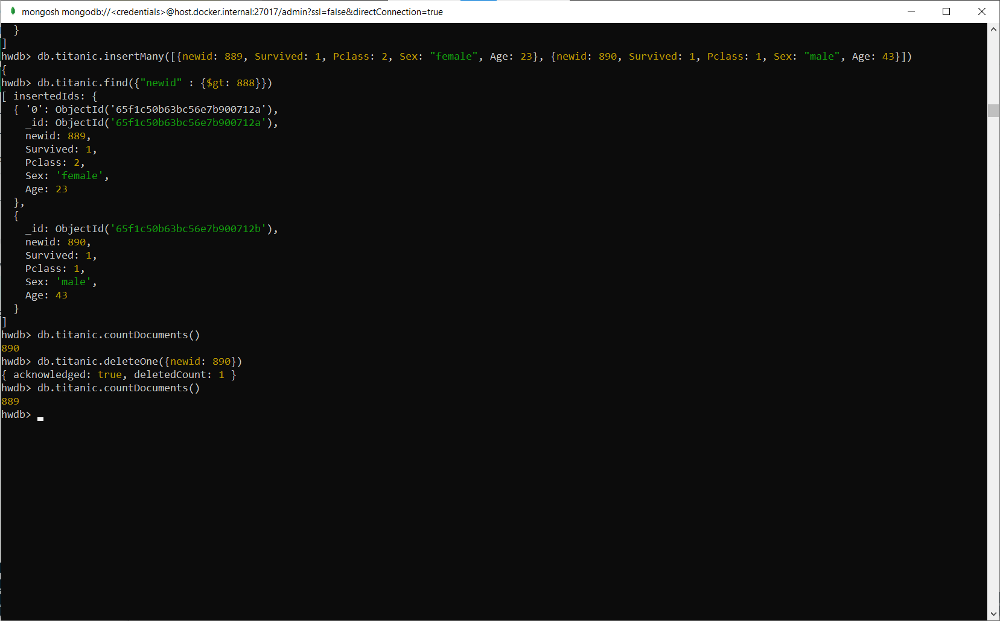

# 2024-Database-systems 1 задание
Homework and materials for the Database Systems course

## Отчет

### Установка Mongo и запуск в Docker

Docker у меня уже был установлен ранее, я создал конфиг для Docker Compose `MongoDocker.yml`, и запустил этот файл командой:

```
docker-compose -f .\MongoDocker.yml up -d
```

<p align="center">
  
  <br>
  <em>Докер с запущенными контейнерами с mongoDB</em>
</p>


Взаимодействовать можно с помощью mongo-express (см. [рис 2](#image2))
, MongoDB Compass и mongosh (см. [рис 3](#image3)).


<a id="image2"></a>
<p align="center">
  
  <br>
  <em>mongo-express</em>
</p>

  <a id="image3"></a>
<p align="center">
  
  <br>
  <em>MongoDB Compass и mongosh</em>
</p>


### Начало работы с mongo через mongosh

Создать базу данных и переключится на нее можно с помощью команды`use`. Посмотреть на не пустые базы данных можно с помощью `show dbs`. Создать коллекцию с помощью `db.createCollection`, а посмотреть коллекции `show collections`. Статистика по ДБ выводится `db.stats()`. MongoDB написана на C++ и в ней можно исполнять код, например `print("Hi everyone!")` (см. [рис 4](#image4))

<a id="image4"></a>
<p align="center">
  
  <br>
  <em>Начало работы</em>
</p>

В качестве тренировочной базы данных я взял популярный датасет [титаник](https://web.stanford.edu/class/archive/cs/cs109/cs109.1166/problem12.html) и загрузил его в нашу ДБ (см. [рис 5](#image5))

<a id="image5"></a>
<p align="center">
  
  <br>
  <em>Titanic</em>
</p>

Выведем некоторую информацию по БД titanic и также поглядим на один из элементов с помощью `findOne` (см. [рис 6](#image6))


<a id="image6"></a>
<p align="center">
  
  <br>
  <em>Информация по БД и вывод одного экземпляра</em>
</p>

Посмотрим на экземпляры с определенными параметрами с помощью `find` и узнаем сколько у нас всего людей в каждом **Pclass** с помощью `aggregate` (см. [рис 7](#image7))

<a id="image7"></a>
<p align="center">
  
  <br>
  <em>Знакомство с find и aggregate</em>
</p>

При загрузке нашей БД я столкнулся с тем, что для наших данных в поле **_id** monga поставила вместо чисел свои значения (см. [рис 8](#image8)). И это крайне не удобно.

<a id="image8"></a>
<p align="center">
  
  <br>
  <em>_id наших данных</em>
</p>

Чтобы решить данную проблему я воспользовался возможностью monga воспринимать код и написал алгоритм, который добавляет новое поле **newid** и пронумерует весь датасет по порядку расположения в БД (см. [рис 9](#image9))
```
let counter = 1;
db.titanic.find().forEach(document => {
  db.titanic.updateOne(
    { _id: document._id },
    { $set: { newid: counter } }
  );
  counter++;
})
```

<a id="image9"></a>
<p align="center">
  
  <br>
  <em>Добавление newid</em>
</p>

Сейчас у наc в БД 887 элементов, добавим еще один с помощью `insertOne` (см. [рис 10](#image10)), и затем еще добавим два элемента с помощью `insertMany` (см. [рис 11](#image11)).  Отметим, что MongoDB создает новые элементы ровно с тем количеством полей, которые мы указали. При этом мы можем добавлять дополнительные поля, отличные от тех, что есть у остальных элементов.

<a id="image10"></a>
<p align="center">
  
  <br>
  <em>insertOne</em>
</p>

<a id="image11"></a>
<p align="center">
  
  <br>
  <em>insertMany</em>
</p>

Посмотрим теперь как работают операции `update` и `replace`.

`Update` позволяет изменить значения определенных полей в существующем элементе БД. Когда мы используем update, мы указываем конкретные поля и значения, которые хотим обновить. Отметим, что update изменяет только те поля, которые были указаны нами в команде, оставляя все остальные поля элемента без изменений. (см. [рис 12](#image12))

`Replace` используется для замены целого элемента новым.  Мы выбираем элемент для замены, `replace` удаляет его и вставляет новый элемент с полями и значениями, которые мы указываем (см. [рис 13](#image13))

<a id="image12"></a>
<p align="center">
  
  <br>
  <em>UpdateOne</em>
</p>

<a id="image13"></a>
<p align="center">
  
  <br>
  <em>ReplaceOne</em>
</p>

Теперь давайте посмотрим на более интересные операции с `find`. `Sort` может сортировать данные по нужным полям и в нужном порядке. Например `sort({ Age: -1 })` отсортирует данные по значению **Age** в обратном порядке. А `limit` выведет столько запросов сколько нужно. Так `limit(3)` будет выводить первые три элемента. (см. [рис 14](#image14))

<a id="image14"></a>
<p align="center">
  
  <br>
  <em>Find, sort и limit</em>
</p>

Операция `find` может также находить элементы, используя различные условия, включая регулярные выражения. Так `find ({ Name: /^J/ })` выдаст нам пассажиров у которых имя начинается на *J* (см. [рис 15](#image15)). Еще мы можем использовать операторы сравнения, которые выбирают элементы, которые меньше или больше чего-то `$lt` и `gt`. Также мы можем использовать в условиях различные логические операторы, такие как  `$and` и `$or`, которые буду находить элементы при выполнении удовлетворяющие всем условиям или как минимум одному (см. [рис 16](#image16)).

<a id="image15"></a>
<p align="center">
  
  <br>
  <em>Поиск с использованием регулярного выражения и логический оператор and</em>
</p>

<a id="image16"></a>
<p align="center">
  
  <br>
  <em>Логический оператор or</em>
</p>

Удалять элементы мы можем с помощью операции `deleteOne` и `deleteMany`. Отличие в том, что, если некоторому условию будут удволетворять несколько элеентов, то `deleteOne` удалит, только первый попавшийся элемент, а `deleteMany` сразу все (см. [рис 17](#image17)).

<a id="image17"></a>
<p align="center">
  
  <br>
  <em>Удаление элементов</em>
</p>

### Ощущения после использования mongoDB

У меня довольно скромный опыт работы с системами базы данных т.к. я пользовался только SQL и то довольно мало. MongoDB показался мне более приятным в использовании, чем SQL и оставил хорошее впечатление. Для меня он более легок в понимании и написании каких-то операций. 

Опыт работы с MongoDB в рамках сегодняшней домашки напомнил мне работу с pandas. Хоть pandas и не является системой управления базами данных, использование MongoDB показалось мне довольно знакомым. Видимо это из-за того что я занимался именно выполнениями операций CRUD.