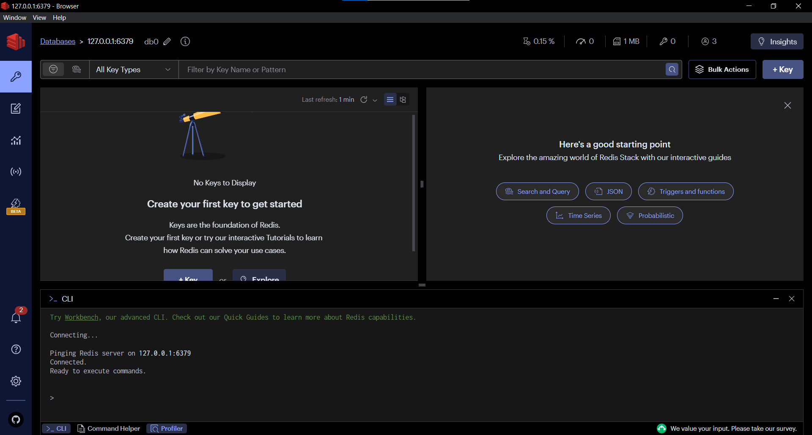
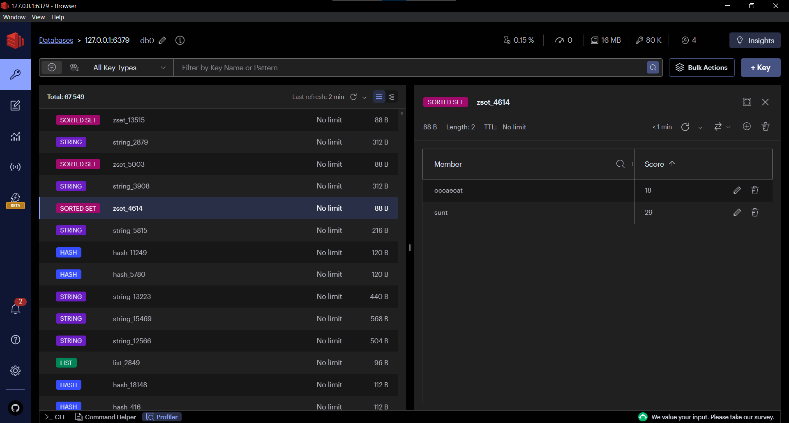
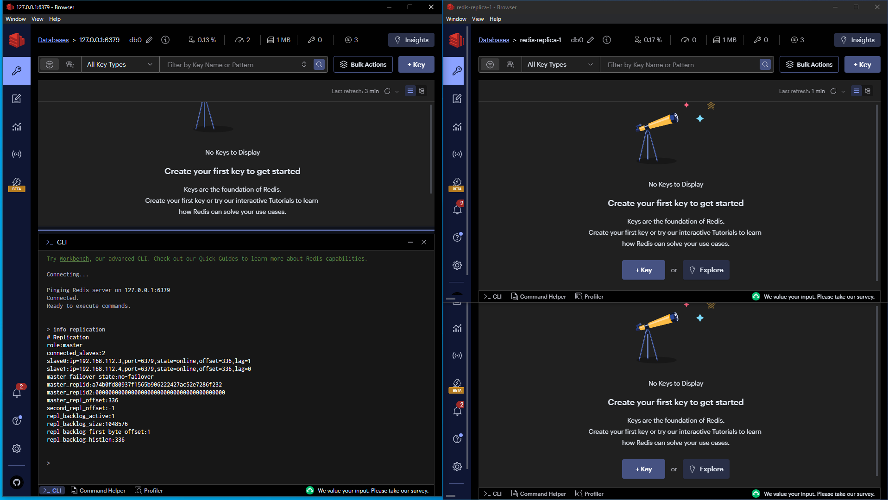
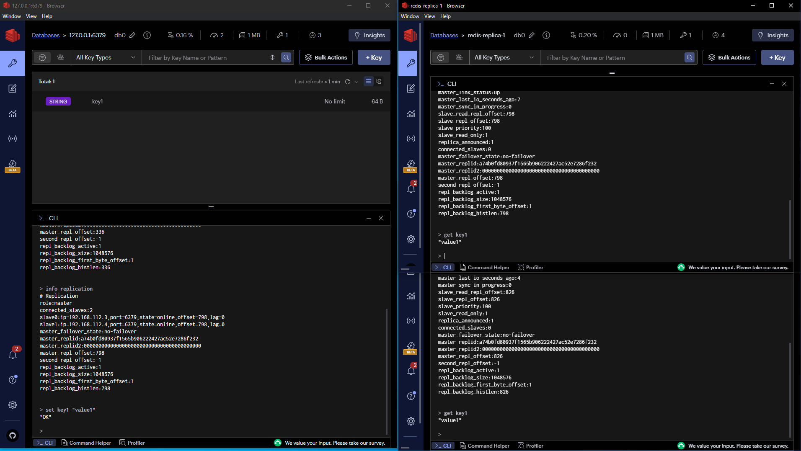

# 2024-Database-systems 2 задание - Redis
Homework and materials for the Database Systems course

## Отчет

### Запуск Redis в Docker

Создаем конфиг для Docker Compose `RedisDocker.yml`, и запускаем контейнер командой:

```
docker-compose -f .\RedisDocker.yml up -d
```
Затем подключаемся к БД с помошью RedisInsight (см. [рис 1](#image1)).


<a id="image1"></a>
<p align="center">
  
  <br>
  <em>Начало работы в RedisInsight</em>
</p>


### Загрузка данных в Redis
Наш JSON файл размером в 20МБ, содержащий структуры типов string, hset, zset, list, мы создадим с помощью сайта [json-generator](https://json-generator.com/). В нем использовали следующий шаблон для генерации данных:

```
{
  "strings": [
    "{{repeat(20000)}}",
    {
      "key": "string_{{index()}}",
      "value": "{{lorem(1, 'paragraphs')}}"
    }
  ],
  "hashes": [
    "{{repeat(20000)}}",
    {
      "key": "hash_{{index()}}",
      "value": {
        "field1": "{{lorem(1, 'words')}}",
        "field2": "{{lorem(1, 'words')}}",
        "field3": "{{lorem(1, 'words')}}"
      }
    }
  ],
  "zsets": [
    "{{repeat(20000)}}",
    {
      "key": "zset_{{index()}}",
      "value": [
        {
          "member": "{{lorem(1, 'words')}}",
          "score": "{{integer(0, 100)}}"
        },
        {
          "member": "{{lorem(1, 'words')}}",
          "score": "{{integer(0, 100)}}"
        }
      ]
    }
  ],
  "lists": [
    "{{repeat(20000)}}",
    {
      "key": "list_{{index()}}",
      "value": [
        "{{lorem(1, 'words')}}",
        "{{lorem(1, 'words')}}",
        "{{lorem(1, 'words')}}"
      ]
    }
  ]
}
```

Для загрузки JSON в нашу БД напишем  скрипт на python `Upload JSON.ipynb` и запустим его. Видим, что все наши данные загрузились в БД (см. [рис 2](#image2)).


<a id="image2"></a>
<p align="center">
  
  <br>
  <em>Загрузка данных в БД</em>
</p>

### Скорость сохранения и чтения

Замерим теперь скорость сохранения и чтения redis. Для этого воспользуемся [**redis-benchmark**](https://redis.io/docs/management/optimization/benchmarks/#pitfalls-and-misconceptions)

`redis-benchmark` — это утилита для оценки производительности Redis. Она позволяет измерить скорость выполнения различных команд Redis под нагрузкой. Вот некоторые из её параметров:

- `-c`: количество параллельных подключений.
- `-n`: общее количество запросов.
- `-r`: использовать случайные ключи для каждого запроса.
- `-q`: тихий режим (меньше деталей в выводе).

Выполним команду `docker exec -it redisdb redis-benchmark -n 100000 -q` и посмотрим на результат. p50 показывает медианное время отклика для каждой операции.
```
PING_INLINE: 153846.16 requests per second, p50=0.159 msec
PING_MBULK: 153846.16 requests per second, p50=0.159 msec
SET: 160256.41 requests per second, p50=0.159 msec
GET: 115606.94 requests per second, p50=0.183 msec
INCR: 143061.52 requests per second, p50=0.167 msec
LPUSH: 155279.50 requests per second, p50=0.167 msec
RPUSH: 156739.81 requests per second, p50=0.159 msec
LPOP: 152207.00 requests per second, p50=0.159 msec
RPOP: 158227.84 requests per second, p50=0.151 msec
SADD: 165289.25 requests per second, p50=0.151 msec
HSET: 166112.95 requests per second, p50=0.151 msec
SPOP: 162074.56 requests per second, p50=0.159 msec
ZADD: 87108.02 requests per second, p50=0.239 msec
ZPOPMIN: 147929.00 requests per second, p50=0.167 msec
LPUSH (needed to benchmark LRANGE): 146198.83 requests per second, p50=0.167 msec
LRANGE_100 (first 100 elements): 60901.34 requests per second, p50=0.415 msec
LRANGE_300 (first 300 elements): 21598.27 requests per second, p50=1.087 msec
LRANGE_500 (first 500 elements): 15130.88 requests per second, p50=1.543 msec
LRANGE_600 (first 600 elements): 13708.02 requests per second, p50=1.703 msec
MSET (10 keys): 176678.45 requests per second, p50=0.151 msec
XADD: 173010.38 requests per second, p50=0.135 msec
```
Увеличим в 10 раз количество записей `docker exec -it redisdb redis-benchmark -n 1000000 -q`.
```
PING_INLINE: 141663.12 requests per second, p50=0.159 msec
PING_MBULK: 137513.75 requests per second, p50=0.167 msec
SET: 154702.97 requests per second, p50=0.159 msec
GET: 141003.95 requests per second, p50=0.167 msec
INCR: 152346.12 requests per second, p50=0.159 msec
LPUSH: 152578.58 requests per second, p50=0.159 msec
RPUSH: 156128.02 requests per second, p50=0.159 msec
LPOP: 145222.19 requests per second, p50=0.159 msec
RPOP: 152951.97 requests per second, p50=0.151 msec
SADD: 142938.83 requests per second, p50=0.159 msec
HSET: 163291.97 requests per second, p50=0.159 msec
SPOP: 144466.92 requests per second, p50=0.159 msec
ZADD: 129048.91 requests per second, p50=0.167 msec
ZPOPMIN: 149767.86 requests per second, p50=0.159 msec
LPUSH (needed to benchmark LRANGE): 160694.20 requests per second, p50=0.159 msec
LRANGE_100 (first 100 elements): 55187.64 requests per second, p50=0.423 msec
LRANGE_300 (first 300 elements): 22736.57 requests per second, p50=1.071 msec
LRANGE_500 (first 500 elements): 15551.62 requests per second, p50=1.495 msec
LRANGE_600 (first 600 elements): 14603.66 requests per second, p50=1.663 msec
MSET (10 keys): 154273.38 requests per second, p50=0.159 msec
XADD: 143595.62 requests per second, p50=0.167 msec
```
Можно сказать, что при увеличении количества запросов. Среднее количество запросов в секунду не изменилось.

По умолчанию тест выполняется с использованием одного ключа. В Redis разница между таким синтетическим тестом и реальным невелика, но можно всетики смоделировать более реальную рабочую нагрузку с помощью параметра `-r`. `docker exec -it redisdb redis-benchmark -r 10000 -n 100000 -q`
```
PING_INLINE: 137174.22 requests per second, p50=0.159 msec
PING_MBULK: 154798.75 requests per second, p50=0.159 msec
SET: 157232.70 requests per second, p50=0.151 msec
GET: 127551.02 requests per second, p50=0.159 msec
INCR: 106609.80 requests per second, p50=0.207 msec
LPUSH: 143061.52 requests per second, p50=0.159 msec
RPUSH: 140252.45 requests per second, p50=0.167 msec
LPOP: 156006.25 requests per second, p50=0.159 msec
RPOP: 173611.12 requests per second, p50=0.151 msec
SADD: 127551.02 requests per second, p50=0.183 msec
HSET: 121654.50 requests per second, p50=0.223 msec
SPOP: 152905.20 requests per second, p50=0.159 msec
ZADD: 137741.05 requests per second, p50=0.199 msec
ZPOPMIN: 152671.77 requests per second, p50=0.159 msec
LPUSH (needed to benchmark LRANGE): 156250.00 requests per second, p50=0.159 msec
LRANGE_100 (first 100 elements): 53022.27 requests per second, p50=0.439 msec
LRANGE_300 (first 300 elements): 22192.63 requests per second, p50=1.071 msec
LRANGE_500 (first 500 elements): 15429.72 requests per second, p50=1.519 msec
LRANGE_600 (first 600 elements): 12350.25 requests per second, p50=1.759 msec
MSET (10 keys): 108695.65 requests per second, p50=0.359 msec
XADD: 177619.89 requests per second, p50=0.135 msec
```
Можно заметить, что при добавлении случайных ключей у нас несколько ухудшились результаты по некоторым командам, которые зависят от уникальности ключей, например, `GET`, `HSET`, `SADD`. Но скорость всеравно остается довольно большой

Теперь попробуем увеличить количество клиентов в 2 раза `docker exec -it redisdb redis-benchmark -c 500 -n 100000 -q`
```
PING_INLINE: 113895.21 requests per second, p50=1.983 msec
PING_MBULK: 122100.12 requests per second, p50=1.959 msec
SET: 123915.74 requests per second, p50=1.903 msec
GET: 118343.19 requests per second, p50=1.991 msec
INCR: 114285.71 requests per second, p50=2.015 msec
LPUSH: 121654.50 requests per second, p50=1.975 msec
RPUSH: 119904.08 requests per second, p50=1.967 msec
LPOP: 123915.74 requests per second, p50=1.935 msec
RPOP: 117233.30 requests per second, p50=1.959 msec
SADD: 111982.08 requests per second, p50=2.055 msec
HSET: 127551.02 requests per second, p50=1.887 msec
SPOP: 115074.80 requests per second, p50=2.071 msec
ZADD: 116822.43 requests per second, p50=1.983 msec
ZPOPMIN: 100300.91 requests per second, p50=2.095 msec
LPUSH (needed to benchmark LRANGE): 72202.16 requests per second, p50=2.775 msec
LRANGE_100 (first 100 elements): 40257.65 requests per second, p50=6.079 msec
LRANGE_300 (first 300 elements): 19197.54 requests per second, p50=12.871 msec
LRANGE_500 (first 500 elements): 13524.48 requests per second, p50=18.383 msec
LRANGE_600 (first 600 elements): 12146.24 requests per second, p50=20.415 msec
MSET (10 keys): 135501.36 requests per second, p50=1.767 msec
XADD: 108813.92 requests per second, p50=2.079 msec
```
Увеличение количества клиентов в 10 раз ухудшило результаты из-за увеличения нагрузки. Большее количество одновременных подключений требует больше ресурсов для управления подключениями и обработки запросов, что приводит к увеличению времени отклика и снижению общей пропускной способности.

**Вывод:** В целом Redis демонстрирует высокую скорость работы, поскольку это in-memory хранилище данных, что позволяет операциям чтения и записи выполняться очень быстро по сравнению с другими базами данных для которых требуется записывать данные на диск.

### Создание кластера

В папке `cluster` содержатся файлы для запуска кластера с одной мастер нодой и двумя нодами репликами. Выведем инфо(см. [рис 3](#image3)).


<a id="image3"></a>
<p align="center">
  
  <br>
  <em>Кластер на 3 нодах</em>
</p>

Убеждаемся в том, что все настроено правильно и при добавлении значения `set key1 "value1"` в мастер ноде, значения обновляются и на репликах. (см. [рис 4](#image3)).


<a id="image4"></a>
<p align="center">
  
  <br>
  <em>Работа мастера и реплик</em>
</p>

В своем клестере я поставил значения timeout, tcp-keepalive и cluster-node-timeou на те значения, которые я считаю оптимальными для работы небольшого кластера
```
timeout 20
tcp-keepalive 20
cluster-node-timeout 3000
```
Понятно, что для нашей задачи их можно было и еще понизить, но перегибать я считаю тоже не надо.
### Ощущения

В целом Redis мне понравился. Он имеет поддержку довольно простых структур данных, с которыми справятся все. Также впечатляет скорость его работы, оно и понято ведь он функционирует в оперативной памяти. Настройка кластера представляла собой задачу не из легких, но и не слишком сложную, при этом документация оказалась вполне понятной даже для новичков.