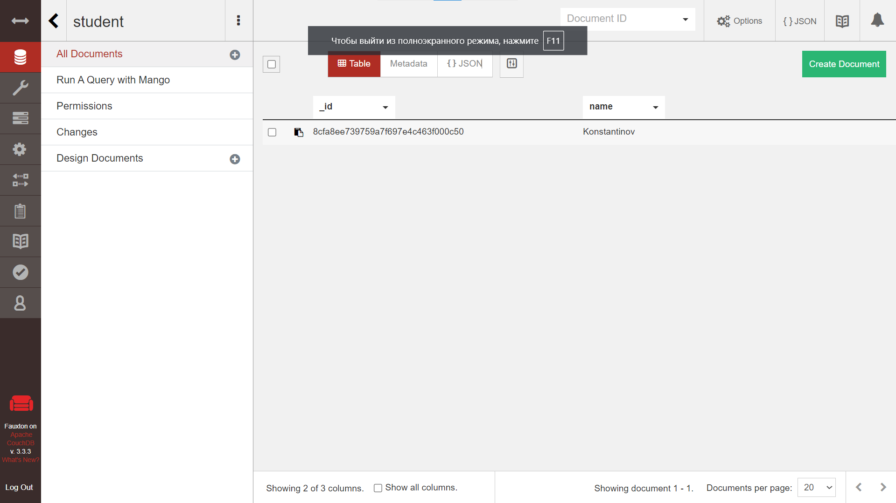

# 2024-Database-systems 2 задание
Homework and materials for the Database Systems course

## Отчет CouchDB + PouchDB

Скачиваем с [сайта](https://couchdb.apache.org/#download) программу и проверяем, что у нас запустился CouchDB по ссылке `http://localhost:5984/` (см. [рис 1](#image1))

  
   
  <em>Запуск couchdb</em>

Далее переходим заходим по ссылке `http://localhost:5984/_utils/#/verifyinstall` и проверяем, что все работает (см. [рис 2](#image2))

  
   
  <em>Проверка работоспособности couchdb</em>

Далее создаем нашу БД под названием **student** и добавляем туда новый документ с **"name": "Konstantinov"** (см. [рис 3](#image3)) и проверяем, что новая запись добавилась ([рис 4](#image4))

  
   
  <em>Добавление записи</em>

  
   
  <em>Проверка записи</em>

Настраиваем и открываем `ДЗ_2.html` в браузере, а затем прожимаем **Sync** для того чтобы появилась строчка с фамилией из нашей БД (см. [рис 5](#image5))

  
   
  <em>Отображение сроки с нашей фамилией</em>

Затем останавливаем службу `Apache CouchDB` через диспетчер задач, обновляем нашу страницу в браузере и прожимаем **Sync** еще раз, и видим что строчка с нашей фамилией также появилась, не смотря на остановку службы (см. [рис 6](#image6))

  
   
  <em>Отображение сроки с нашей фамилией после остановки службы</em>

После скачиваем наш html файл с браузера и сохраняем под названием `ДЗ_2_final.html`