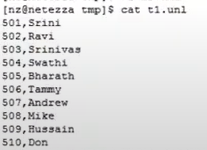
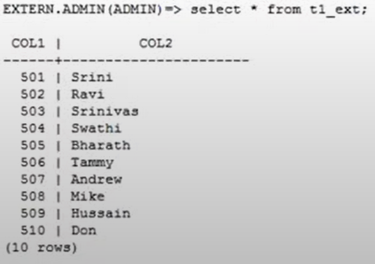
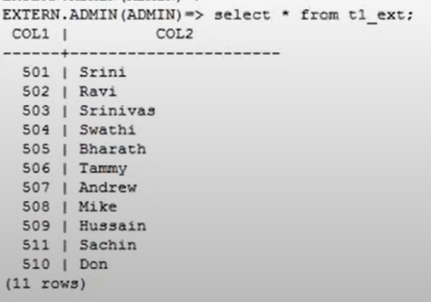
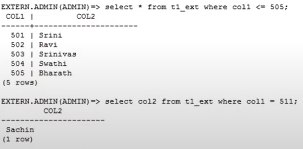
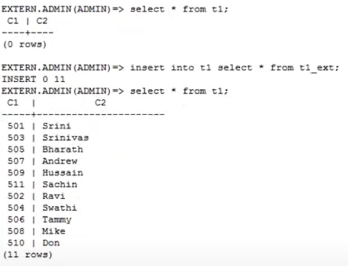

# Знакомство с Netezza

## a. История развития СУБД

[**Netezza**](https://ru.wikipedia.org/wiki/Netezza) – американская компания, разработчик аппаратно-программных комплексов хранилищ данных — кластеров серверов реляционных баз данных, обеспечивающих массово-параллельную обработку, приобретенная IBM в 2010 году. Эта технология изначально разрабатывалась как специализированное решение для аналитики больших данных на аппаратном обеспечении. Система использует архитектуру под названием Asymmetric Massively Parallel Processing (AMPP), которая сочетает в себе высокопроизводительные серверы и дисковые массивы для обработки больших объемов данных.

### IBM и развитие Netezza
IBM приобрела Netezza за 1,7 миллиарда долларов, что стало значительным шагом для IBM в сфере технологий больших данных. Под эгидой IBM, технология Netezza получила значительные инвестиции в разработку и была интегрирована в более широкие продуктовые линейки IBM, направленные на аналитику и облачные вычисления.

### [Версии Netezza](https://en.wikipedia.org/wiki/Netezza)

1. Netezza Performance Server - это название, под которым продукт был перезапущен в рамках IBM Cloud Pak for Data, обеспечивая тесную интеграцию с облачными и гибридными облачными технологиями.
2. Netezza TwinFin - одна из ранних моделей под IBM, которая значительно улучшила производительность и масштабируемость.
3. Netezza Skimmer, Striper и S-Blades - различные улучшения в оборудовании, направленные на увеличение производительности и емкости хранения данных.

На данный момент самая последняя версия — это IBM Netezza Performance Server, анонсированная в 2019 году. Эта версия предлагает продвинутые аналитические возможности, оптимизирована для работы в гибридных и облачных средах и поддерживает интеграцию с различными сервисами и технологиями IBM, такими как Watson и другие инструменты искусственного интеллекта. Это решение предназначено для компаний, которые требуют масштабируемости, высокой производительности и гибкости в обработке больших объемов данных. Система поддерживает все основные языки программирования, включая Python, C, C++, R, Lua и Java. [Ссылка](https://www.ibm.com/products/netezza)


## b.	Инструменты для взаимодействия с СУБД

[Для взаимодействия с СУБД Netezza Performance Server можно использовать следующие инструменты](https://www.ibm.com/docs/en/iis/11.7?topic=8000-client-interfaces-accessing-netezza-performance-server):

1. ODBC-клиент. Позволяет приложениям и инструментам для создания приложений получать доступ к базам данных SQL.
2. Netezza-клиент. Необходим, если нужно загрузить данные в Netezza Performance Server с помощью метода nzload.
3. Web-клиент. Инструмент администратора, основанный на браузере. Позволяет мониторить и администрировать систему Netezza Performance Server из популярных веб-браузеров.
4. Клиент для Linux или Solaris. Позволяет вводить SQL-запросы. Также предоставляет возможность управления системой и базами данных с помощью команд интерфейса командной строки Netezza.
5. Клиент JDBC. Позволяет программам на Java получать доступ к базам данных SQL.


## c. Какой database engine используется в СУБД Netezza?

[Netezza использует специализированный database engine, разработанный для высокопроизводительной обработки и анализа больших объемов данных:](https://en.wikipedia.org/wiki/Netezza)

* **Asymmetric Massively Parallel Processing (AMPP).**
 Netezza использует архитектуру AMPP, которая сочетает в себе высокопроизводительные серверы (хосты) с множеством процессоров и массив дисков. Эта архитектура позволяет эффективно распределять процесс обработки данных между серверами и хранилищами, минимизируя таким образом время обработки за счет параллельного выполнения операций.

* **FPGA (Field-Programmable Gate Array).**
FPGA позволяют выполнение некоторых операций по обработке данных прямо на аппаратном уровне, что значительно ускоряет обработку запросов. FPGA могут быстро фильтровать данные, выполняя операции, такие как предварительная фильтрация строк, прежде чем данные будут переданы на процессоры для дальнейшей обработки. Это снижает объем данных, необходимых для обработки на более высоком уровне, что ускоряет процесс.


## d.	Как устроен язык запросов в вашей СУБД? Разверните БД с данными и выполните ряд запросов. 

Язык запросов в СУБД Netezza основан на SQL, который является стандартным языком для управления и манипуляции реляционными базами данных.

Netezza это аппаратно-программный комплекс, оптимизированный для работы на специализированном оборудовании и к сожалению я не нашел способа развернуть БД на своем ПК. Поэтому я ориентируясь на [видео](https://www.youtube.com/watch?v=mpqwtjbImNI) и [документацию по SQL запросам в Netezza](https://www.ibm.com/docs/zh/psfa/7.2.1?topic=documentation-netezza-sql-basics) привел пример работы с таблицой. Netezza в основном оперирует классическими SQL запросами. Пример:

**Создание таблицы:** 
```
CREATE TABLE employees (
    id INTEGER PRIMARY KEY,
    name VARCHAR(100),
    position VARCHAR(100),
    salary DECIMAL(10, 2)
);

```

**Вставка данных:**
```
INSERT INTO employees (id, name, position, salary) VALUES (1, 'John Doe', 'Software Engineer', 90000.00);
INSERT INTO employees (id, name, position, salary) VALUES (2, 'Jane Smith', 'Data Analyst', 85000.00);
INSERT INTO employees (id, name, position, salary) VALUES (3, 'Sam Brown', 'Project Manager', 92000.00);
```
**Выборка данных:**
```
SELECT * FROM employees;
```

**Обновление данных:**
```
UPDATE employees SET salary = salary + 5000 WHERE id = 1;
```

**Удаление данных:**
```
DELETE FROM employees WHERE id = 3;
```

## e.	Распределение файлов БД по разным носителям?

В СУБД Netezza данные распределяются по разным носителям следующим образом:

1. Netezza хранит данные в виде таблиц, которые автоматически распределяются по физическим дискам в системе. Это распределение основано на следующих принципах:

* **Хэш-распределение:** При создании таблицы администратор или система может указать столбец (или столбцы), который будет использоваться для хэш-распределения записей по дискам. Netezza применяет хэш-функцию к значению этого столбца для каждой строки, чтобы определить, на каком диске будет храниться эта строка. Это обеспечивает равномерное и эффективное распределение данных, что важно для параллельной обработки запросов.

* **Репликация зеркал:** Кроме хэш-распределения, Netezza также использует зеркальную репликацию для повышения надежности и доступности данных. Каждый фрагмент данных хранится в двух копиях на разных дисках, что обеспечивает высокую степень устойчивости к отказам

2. Организация данных на дисках.
Данные в Netezza организованы в блоки. Каждый блок данных состоит из нескольких строк, и каждый блок хранится на диске. При обработке запроса система читает только те блоки, которые содержат необходимые данные, что значительно снижает количество операций ввода/вывода и ускоряет обработку запросов.

3. S-Blades и процессоры.
Netezza использует специальные узлы обработки данных, называемые S-Blades, каждый из которых содержит один или несколько процессоров и локальные диски. S-Blades обрабатывают данные параллельно, каждый узел работает с данными, хранящимися на его локальных дисках. Это позволяет минимизировать пересылку данных между узлами и ускорить обработку запросов.

4. Управление данными. Система управления базами данных Netezza автоматически управляет распределением и балансировкой данных по дискам, не требуя от пользователя ручного вмешательства. Это значительно упрощает администрирование системы и позволяет сосредоточиться на аналитике данных.

## f.	На каком языке/ах программирования написана СУБД?

Серверный код IBM Netezza в основном написан на C++. Этот язык программирования используется из-за его эффективности и производительности, которые необходимы для крупномасштабной обработки данных. Кроме того, Netezza использует высокооптимизированный SQL для управления базами данных.

## g.	Какие типы индексов поддерживаются в БД? Приведите пример создания индексов.

Netezza отличается от традиционных реляционных СУБД, таких как Oracle или MySQL, в своем подходе к индексированию данных. Вместо традиционных B-tree и хеш-индексов, Netezza использует концепцию зонирования и организацию данных, которая оптимизирует сканирование таблиц и обеспечивает быструю обработку запросов.

Netezza не поддерживает создание индексов для таблиц. В базе данных Netezza нет необходимости в индексах, поскольку производительность достигается за счет распределения строк данных по нескольким дискам. Netezza отслеживает минимальные/максимальные значения каждого столбца для каждого экстента диска, чтобы игнорировать экстенты, которые не содержат значений, которые ищет запрос. [Ссылка](https://4js.com/online_documentation/fjs-fgl-2.50.02-manual-html/c_fgl_odiagntz_037.html#:~:text=Netezza%C2%AE%20does%20not%20support%20index%20creation%20on%20tables.)

Если отвечать кратко, то у Netezza нет индексов в привычном понимании, вместо этого у нее есть зонные карты.

## h.	Как строится процесс выполнения запросов в вашей СУБД?

IBM Netezza обрабатывает SQL-запросы через несколько ключевых этапов, оптимизированных для быстрой обработки и анализа больших объемов данных:

**1. Подготовка и разбор запроса**

Когда запрос поступает в Netezza, первым делом он проходит этап синтаксического анализа и разбора. В этот момент SQL-запрос проверяется на наличие синтаксических ошибок, а затем преобразуется во внутреннее представление. Этот этап включает разбор запроса и его преобразование в логический план выполнения, который описывает последовательность операций, необходимых для получения результатов.

**2. Оптимизация запроса**

На этом этапе логический план преобразуется в физический план, который определяет, как именно данные будут извлекаться из базы данных. Оптимизатор запросов Netezza анализирует различные стратегии выполнения запроса, учитывая статистику данных, индексы (зонные карты), распределение данных и доступные ресурсы. Цель этого этапа — минимизировать время выполнения запроса и количество обрабатываемых данных.

**3. Выполнение запроса**

После того как оптимизатор выбирает наилучший план выполнения, запрос передается на исполнение. В Netezza данные распределены и обрабатываются параллельно множеством процессоров. Каждый процессор, или S-Blade, обрабатывает данные, которые физически находятся на своих локальных дисках. Это позволяет минимизировать перемещение данных и ускорить обработку запроса.

**4. Агрегация результатов**

После того как каждый процессор обработает свою часть данных, результаты собираются и агрегируются. Этот процесс может включать сортировку, агрегацию или другие операции, необходимые для формирования конечного результата запроса.

**5. Возврат результатов**

Финальный шаг — отправка обработанных данных обратно клиенту. Результаты могут быть представлены в виде таблицы, или же они могут быть использованы для дальнейшей обработки в других запросах или транзакциях.

## i.	Есть ли для вашей СУБД понятие «план запросов»? Если да, объясните, как работает данный этап.

[Ссылка](https://www.iexpertify.com/learn/netezza-query-plan-analysis/)

Как строится и анализируется план запросов:

Генерация и оптимизация плана:
При получении SQL-запроса, Netezza компилирует его и создает несколько потенциальных планов выполнения, каждый из которых предлагает различные стратегии доступа к данным и их обработки. Оптимизатор запросов оценивает каждый план на основе различных метрик, таких как ожидаемое время выполнения и затраты на ресурсы.

Выбор плана:
Из всех возможных планов оптимизатор выбирает наиболее эффективный с точки зрения стоимости. Стоимость рассчитывается с учетом факторов, таких как объем данных, которые нужно прочитать, количество операций ввода-вывода и требуемая вычислительная мощность.

Исполнение плана:
После выбора плана, он отправляется на выполнение. Netezza использует свою мощную массово-параллельную обработку для эффективной реализации плана. Распределенная архитектура Netezza позволяет одновременно обрабатывать запросы на нескольких процессорах, что значительно ускоряет обработку данных.

Анализ плана запросов:
Для анализа и оптимизации запросов в Netezza можно использовать команду EXPLAIN, которая выводит детальный план выбранного запроса. Это включает информацию о путях доступа к данным, операциях соединения и агрегации, а также оценки использования ресурсов. Понимание этих деталей помогает разработчикам оптимизировать SQL-запросы для лучшей производительности.

## j.	Поддерживаются ли транзакции в вашей СУБД? Если да, то расскажите о нем. Если нет, то существует ли альтернатива?

[Ссылка на документацию](https://www.ibm.com/docs/en/psfa/7.2.1?topic=categories-transaction-control)

Да, СУБД IBM Netezza поддерживает транзакции, что является ключевым аспектом для обеспечения целостности данных и поддержки конкурентных операций. Транзакции в Netezza управляются так, чтобы соответствовать стандартам ACID (атомарность, согласованность, изоляция, долговечность)

Контроль транзакций обеспечивает целостность базы данных, гарантируя, что пакеты операций SQL выполняются полностью или не выполняются вообще. Командами управления транзакциями являются BEGIN, COMMIT и ROLLBACK.

IBM Netezza SQL поддерживает режим автоматической фиксации транзакций. В этом режиме все команды SQL фиксируются при их запуске. Если система встречает команду SQL до команды BEGIN SQL, она запускает команду SQL в режиме автоматической фиксации транзакции. Если система встречает команду BEGIN SQL, она запускает все последующие команды SQL в рамках транзакции. Чтобы завершить транзакцию, необходимо выполнить команду SQL COMMIT или ROLLBACK.

## k.	Какие методы восстановления поддерживаются в вашей СУБД. Расскажите о них.

[Ссылка 1](https://www.ibm.com/docs/en/netezza?topic=basics-general-information-about-backup-restore-methods)

[Ссылка 2](https://dwgeek.com/netezza-backup-and-restore-best-practices.html/)

В IBM Netezza поддерживаются несколько методов восстановления данных. Восстановление данных в Netezza включает использование как локальных, так и удаленных резервных копий, что позволяет администраторам выбирать наиболее подходящий метод в зависимости от конкретных требований к безопасности и доступности данных. Вот основные методы восстановления, поддерживаемые в Netezza:


1. Резервное копирование и восстановление
* Резервное копирование

    **Полное резервное копирование:** Позволяет создать полную копию всех данных в базе данных. Это наиболее простой и надежный способ защиты данных, но он может потреблять значительные ресурсы и время.

    **Инкрементное резервное копирование:** После создания полной резервной копии, инкрементные резервные копии сохраняют только те данные, которые изменились с момента последнего резервного копирования. Это уменьшает объем данных, которые нужно копировать, и ускоряет процесс резервного копирования.

* Восстановление

    Восстановление данных может быть выполнено как на уровне всей базы данных, так и на уровне отдельных объектов или таблиц. Администраторы могут выбирать из резервных копий полного или инкрементного типа для восстановления данных до состояния на определенный момент времени.

2. Зеркальное дублирование

Netezza поддерживает зеркальное дублирование данных на уровне аппаратного обеспечения. Каждый блок данных автоматически дублируется на отдельных физических дисках в рамках системы хранения данных. Это обеспечивает высокий уровень отказоустойчивости и позволяет системе продолжать функционировать даже в случае отказа одного из дисков.

3. Репликация данных

Репликация данных в Netezza позволяет создавать копии данных на удаленных серверах, что обеспечивает дополнительный уровень защиты и улучшает доступность данных. Этот метод особенно полезен для организаций с распределенной инфраструктурой и требованиями к географической отказоустойчивости.

## l.	Расскажите про шардинг в вашей конкретной СУБД. Какие типы используются? Принцип работы.

Шардинг в контексте СУБД IBM Netezza отличается от традиционного понятия шардинга, как оно используется в других базах данных, таких как MongoDB или MySQL. Вместо разделения данных на разные серверы или базы данных, Netezza использует концепцию распределения данных на аппаратном уровне в рамках одной системы, что оптимизирует обработку и доступ к данным. Этот подход тесно связан с архитектурой Netezza и специфическими особенностями её реализации параллельной обработки.

Шардинг в контексте СУБД IBM Netezza отличается от традиционного понятия шардинга, как оно используется в других базах данных, таких как MongoDB или MySQL. Вместо разделения данных на разные серверы или базы данных, Netezza использует концепцию распределения данных на аппаратном уровне в рамках одной системы, что оптимизирует обработку и доступ к данным. Этот подход тесно связан с архитектурой Netezza и специфическими особенностями её реализации параллельной обработки.
Принцип работы шардинга в Netezza

В Netezza данные автоматически распределяются по дискам и S-Blades (специализированные узлы обработки) во время их загрузки. Этот процесс управляется двумя основными концепциями: распределением и зонами.

## l.	Расскажите про шардинг в вашей конкретной СУБД. Какие типы используются? Принцип работы.

Шардинг в контексте СУБД IBM Netezza отличается от традиционного понятия шардинга, как оно используется в других базах данных, таких как MongoDB или MySQL. Вместо разделения данных на разные серверы или базы данных, Netezza использует концепцию распределения данных на аппаратном уровне в рамках одной системы, что оптимизирует обработку и доступ к данным. Этот подход тесно связан с архитектурой Netezza и специфическими особенностями её реализации параллельной обработки.

### Принцип работы шардинга в Netezza

В Netezza данные автоматически распределяются по дискам и [S-Blades ](https://www.ibm.com/docs/en/psfa/7.2.1?topic=summary-snippet-blades-s-blades)(специализированные узлы обработки) во время их загрузки. Этот процесс управляется двумя основными концепциями: распределением и зонами.

[**1. Распределение данных (Data Distribution).**](https://www.ibm.com/docs/en/db2/11.5?topic=groups-distribution-keys)
Каждая таблица в Netezza может быть настроена на использование определенного ключа распределения. Этот ключ определяет, как данные будут распределены по доступным дискам в системе. Процесс распределения основан на хэш-функции, применяемой к ключу распределения каждой строки.

[**2. Зоны (Zone Maps).**](https://www.ibm.com/docs/it/psfa/7.2.1?topic=statistics-zone-maps)
Netezza автоматически создает зонные карты для каждого сегмента данных на диске. Зонные карты содержат метаданные о минимальных и максимальных значениях каждого столбца в данном сегменте. Это позволяет СУБД быстро определить, содержат ли сегменты данные, соответствующие критериям запроса, и пропустить те сегменты, которые точно не содержат нужных данных.

При выполнении запроса, например, выборки данных для определенного region_id, Netezza сначала проверяет зонные карты, чтобы определить, какие сегменты данных содержат информацию по этому региону. Затем система обращается только к тем дискам, которые содержат нужные данные, что существенно сокращает количество дисковых операций и время выполнения запроса.

## m.	Возможно ли применить термины Data Mining, Data Warehousing и OLAP в вашей СУБД?

[Datasheet](https://ftpmirror.your.org/pub/misc/ftp.software.ibm.com/software/cz/pdf/IBM_Netezza_-_to_prave_pro_Analytiky.pdf)

**1. Data Warehousing**.

Netezza часто используется как платформа для data warehousing благодаря своей способности быстро обрабатывать и анализировать большие объемы данных. Основные преимущества Netezza для хранения данных включают:

* **Высокая производительность:** Специализированная архитектура и параллельная обработка данных позволяют Netezza обеспечивать высокую скорость обработки запросов, что критически важно для data warehousing.

* **Масштабируемость:** Возможность добавления дополнительных ресурсов (например, S-Blades) позволяет легко масштабировать систему в соответствии с растущими потребностями хранения данных.

* **Управление данными:** Поддержка больших объемов данных и сложных аналитических запросов делает Netezza подходящей для интеграции и агрегации данных из различных источников.

**2. OLAP (Online Analytical Processing)**

Netezza эффективно поддерживает OLAP-операции, такие как сложные запросы с множественными агрегациями и многомерными анализами.

* **Аналитическая обработка:** Благодаря мощной параллельной обработке и оптимизации запросов Netezza позволяет выполнять сложные аналитические запросы, включая многомерный анализ данных.

* **Быстрые ответы на запросы:** Оптимизированные алгоритмы и хранение данных обеспечивают быструю обработку даже очень сложных запросов.

**3. Data Mining**

Netezza может использоваться в Data Mining.

* **Интеграция с аналитическими инструментами:** Netezza может интегрироваться с внешними инструментами и платформами, предназначенными для добычи данных, такими как R, Python или специализированные инструменты для data mining.

* **Поддержка больших объемов данных:** Возможность быстрой обработки и анализа больших объемов данных делает Netezza идеальной для задач, где data mining применяется для выявления закономерностей и тенденций в больших наборах данных.

## n.	Какие методы защиты поддерживаются вашей СУБД? Шифрование трафика, модели авторизации и т.п.

1. Шифрование данных.

* [**Шифрование на уровне диска:**](https://dwgeek.com/netezza-data-transformation-functions-and-examples.html/) Netezza предлагает возможность шифрования на уровне диска, что обеспечивает защиту данных в покое. Это означает, что все данные, сохраненные на физических дисках, автоматически шифруются, что предотвращает несанкционированный доступ в случае физического изъятия накопителя.
* [**Шифрование сетевого трафика:**](https://www.ibm.com/docs/en/psfa/7.2.1?topic=control-netezza-client-encryption-security) Для защиты данных в процессе передачи Netezza поддерживает шифрование сетевого трафика через SSL/TLS. Это гарантирует, что все данные, передаваемые между клиентом и сервером, защищены от перехвата и несанкционированного доступа.

2. [Управление доступом.](https://learn.microsoft.com/ru-ru/azure/synapse-analytics/migration-guides/netezza/3-security-access-operations)

* **Аутентификация:** Netezza поддерживает несколько методов аутентификации, включая встроенные средства управления пользователями и группами, а также интеграцию с LDAP и Active Directory для централизованного управления учетными записями.
* **Ролевой доступ:** В Netezza доступ к данным и операциям можно контролировать с помощью ролей. Роли позволяют администраторам назначать разрешения на определенные действия, что упрощает управление правами доступа и повышает безопасность.

3. Аудит и мониторинг

* [**Журналирование аудита:**](https://g14n.info/2013/12/how-to-collect-netezza-history/) Netezza предоставляет подробные журналы аудита, в которых фиксируются все важные события, такие как входы в систему, запросы данных и административные операции. Это позволяет отслеживать и анализировать все действия, выполненные в системе, что критически важно для выявления и реагирования на возможные угрозы безопасности.
* [**Мониторинг:**](https://www.datasunrise.com/monitoring/netezza/) Netezza также предлагает инструменты для мониторинга производительности и активности системы, что помогает администраторам оперативно реагировать на необычные паттерны поведения, которые могут указывать на попытки нарушения безопасности.

4. Обеспечение целостности данных

* [**Транзакционная целостность:**](https://stackoverflow.com/questions/26491329/are-netezza-and-hive-for-hadoop-acid-compliant) Netezza поддерживает модель ACID для транзакций, что гарантирует целостность данных даже в случае сбоев системы или ошибок при выполнении операций.

## o.	Какие сообщества развивают данную СУБД? Кто в проекте имеет права на коммит и создание дистрибутива версий? Расскажите об этих людей и/или компаниях.

Как и говорилось выше, на данный момент все права полностью принадлежат компании IBM, именно она сейчас занимается разработкой и поддержкой СУБД Netezza.

Также есть сообщество [Netezza Developer Network](https://www.ibm.com/docs/en/psfa/7.2.1?topic=introduction-netezza-developer-network), где разработчики и партнеры участвуют в развитии Netezza.

## p.	Создайте свои собственные данные для демонстрации работы СУБД. 

Так как развернуть локально собственную БД не возможно без нужно аппаратной части, то воспользуемся роликом с [ютуба](https://www.youtube.com/watch?v=mpqwtjbImNI), где создадим таблицу из данных в файле.

У нас имеется файл t1.unl, где в первом столбце записаны id, а вот втором имя пользователя (см. [рис 1](#image1)).

<a id="image1"></a>
<p align="center">
  
  <br>
  <em>Исходные данные</em>
</p>

Далее мы создаем внешнюю таблицу t1_ext, которая ссылается на данные файла t1.unl, делается это для того чтобы с данными можно было работать с помощью SQL запросов. Делается это командой:
```
CREATE EXTERNAL TABLE t1_ext (col1 INTEGER, col2 CHAR(20))
USING (DATAOBJECT('/tmp/t1.unl') DELIMITER ',');
```
В этой команде мы указываем формат нашей таблицы и то откуда мы загружаем данные и какой у них разделитель. Посмотри на нашу таблицу командой `select * from t1_ext` (см. [рис 2](#image2)).

<a id="image2"></a>
<p align="center">
  
  <br>
  <em>Данные в таблице t1_ext</em>
</p>

Так как наша таблица **t1_ext** ссылается на данные в файле **t1.unl**, то мы можем добавить в файл новые данные и это отобразится в нашей таблице. Добавим в файл **t1.unl** строку `511,Sachin` и снова посмотрим на нашу таблицу (см. [рис 3](#image3)).

<a id="image3"></a>
<p align="center">
  
  <br>
  <em>Обновленные данные в таблице t1_ext</em>
</p>

Также теперь мы можем выполнять различные запросы к нашей таблице, например `select * from t1_ext where col1 <= 505;` или `select * from t1_ext where col1 = 511;` (см. [рис 4](#image4)).

<a id="image4"></a>
<p align="center">
  
  <br>
  <em>Фильтрация данных</em>
</p>

Так как у нас теперь есть внешняя таблица, то давайте теперь загрузим данные в таблицу нашей СУБД Netezza. Создадим внутреннею таблицу **t1** командой `CREATE TABLE t1 (col1 INTEGER, col2 CHAR(20));` и затем загрузим в нее данные из внешней таблицы **t1_ext** командой `INSERT INTO t1 SELECT * FROM t1_ext;` и посмотрим на наши данные в **t1** (см. [рис 5](#image5)).

<a id="image5"></a>
<p align="center">
  
  <br>
  <em>Наши данные в Netezza</em>
</p>

Таким образом мы научились подгружать данные в нашу БД Netezza.

## q.	Как продолжить самостоятельное изучение языка запросов с помощью демобазы. Если демобазы нет, то создайте ее.

В прошлом пункте мы научились подгружать данные в нашу БД. Чтобы продолжить изучение языка запросов Netezza рекомендую посмотреть [документацию](https://www.ibm.com/docs/zh/psfa/7.2.1?topic=documentation-netezza-sql-basics).

## r.	Где найти документацию и пройти обучение
1. [Официальная документация IBM Netezza](https://www.ibm.com/docs/en/psfa/7.2.1?topic=netezza-database-user-documentation)
2. [Обучающие курсы IBM Netezza](https://www.ibm.com/training/search?query=netezza)
3. [Ютуб канал IBM Technology](https://www.youtube.com/@IBMTechnology)
4. [Курс для новичков по IBM Netezza на ютуб](https://www.youtube.com/playlist?list=PLCNIKwM6iuv5oIiUB9rwHa6ol6tCSRi3L)
5. [Онлайн курс](https://mindmajix.com/ibm-netezza-training)
6. [Книга по архитектуре IBM Netezza](https://www.redbooks.ibm.com/redbooks/pdfs/redp4725-00-ru.pdf)


## s.	Как быть в курсе происходящего

В последнее время с IBM Netezza мало что происходит, но чтобы быть в курсе событии, то рекомендую смотреть различные форумы и блог:

1. [Форум и сообщество](https://community.ibm.com/community/user/datamanagement/communities/community-home/recent-community-blogs?CommunityKey=d9f9d5de-e89f-4a6a-84a0-31df8b81f182)
2. [Блог](https://www.ibm.com/blog/tag/netezza/)